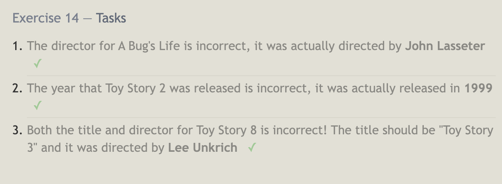

# Reading Notes

## Code 401 - Advanced Software Development: SQL Practice

## Summary

Structured Query Language (SQL) is a popular and industry-standard language used to access and manage databases from various programming languages, such as Java or C/C++. As database is used to organize nd store information/data; SQL is a popular tool used to handle these databases.

Relational database consists of related tables, each relational database is depicted by table resembling a two-dimensional structure, similar to an Excel spreadsheet. Tables have fixed number of named columns that represent the attributes or properties of the data, and rows that store the actual data records.

Going through these exercises reminded me of how we retrieve data from objects and arrays. When working with objects and arrays in JavaScript, retrieving data typically involves accessing specific properties or elements within the object or array. Similarly, in the context of SQL, retrieving data involves doing something similar, as it entails querying/filtering the database using SQL commands. Overall, the practice exercises in SQL help reinforce the concepts of retrieving data, filtering and sorting data, and manipulating tables to obtain the results you want.

**Lesson 1 - 6**

**Lesson 13-18**

